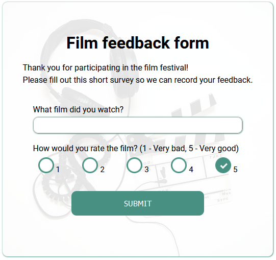

# Online survey

This is a web application for an online survey for a local film festival. The application will be used to gather feedback on the films screened during the festival.

<br>

## Technologies

-   React JS 17.0.2
-   Normalize 8.0.1
-   Prettier 2.4.1
-   Craco 6.4.1
-   classnames 2.3.1
-   msw 0.36.1
-   uuid 3.4.0

<br>

## Instalation

### Install it localy using npm:

```
$ nmp install
$ npm start
```

## Image

<br>
<p align="center">

</p>
